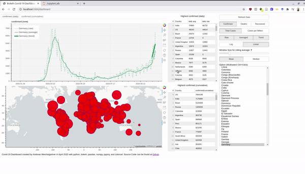
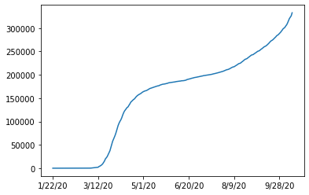
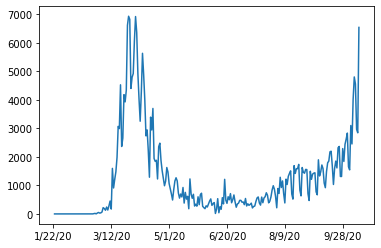
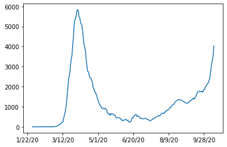
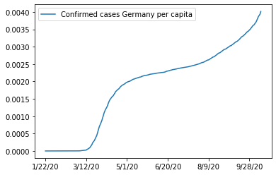
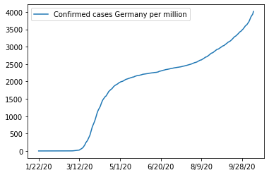
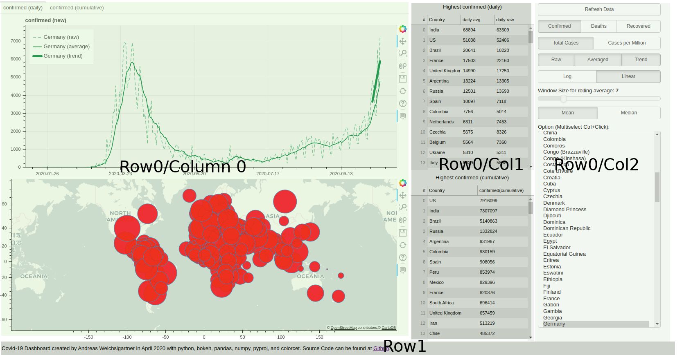

# Creating a Covid-19 Dashboard with bokeh, pandas, numpy, etc.

There is a plethora of Covid-19 dashboards in the depths of the internet.
However, they often let you not play around with the data and the parameters.
So why not just build out own and customize it to our preferences.
For interactive plots and visualization I love to work with bokeh.
Without having to write javascript you can create everything you need for a dashboard and creates javascript output which can be rendered nicely in your browser.
The final product looks like this:


An interactive version is hosted at [Heroku](https://covid-19-bokeh-dashboard.herokuapp.com/dashboard).
Before we dive into the bokeh stuff, we take first a look at the data.
Afterwards, I also explain briefly how you can use the Rest-Api and host a Python app for free at Heroku. 

## The Data

The root of all visualization is always the data.
Thankfully, the Johns Hopkins University (JHU) offers raw data in csv format at their [github account](https://github.com/CSSEGISandData/COVID-19/tree/master/csse_covid_19_data).
So what is the first thing you do if you have csv files? 
You fire up a jupyter notebook (personally I use jupyter lab) and explore the data with pandas and some numpy.

So let's get started and import these two wonderful libraries:

```python
import pandas as pd
import numpy as np
```

Then we use the the raw urls from Github.
```python
url_confirmed = 'https://raw.githubusercontent.com/CSSEGISandData/COVID-19/master/csse_covid_19_data/csse_covid_19_time_series/time_series_covid19_confirmed_global.csv'
url_death = 'https://raw.githubusercontent.com/CSSEGISandData/COVID-19/master/csse_covid_19_data/csse_covid_19_time_series/time_series_covid19_deaths_global.csv'
url_recovered = 'https://raw.githubusercontent.com/CSSEGISandData/COVID-19/master/csse_covid_19_data/csse_covid_19_time_series/time_series_covid19_recovered_global.csv'
```

These files are updated daily, so we get the latest version.
In pandas you can directly paste the URL into the read_csv function and load the remote file into a dataframe.

```python
df = pd.read_csv(url_confirmed) 
```

With the `head()` we can get the first rows of the dataframe and see how the data is structured.
```python
df.head()
```


<div>
<style scoped>
    .dataframe tbody tr th:only-of-type {
        vertical-align: middle;
    }

    .dataframe tbody tr th {
        vertical-align: top;
    }

    .dataframe thead th {
        text-align: right;
    }
</style>
<table border="1" class="dataframe">
  <thead>
    <tr style="text-align: right;">
      <th></th>
      <th>Province/State</th>
      <th>Country/Region</th>
      <th>Lat</th>
      <th>Long</th>
      <th>...</th>
      <th>10/14/20</th>
      <th>10/15/20</th>
      <th>10/16/20</th>
      <th>10/17/20</th>
    </tr>
  </thead>
  <tbody>
    <tr>
      <th>0</th>
      <td>NaN</td>
      <td>Afghanistan</td>
      <td>33.93911</td>
      <td>67.709953</td>
      <td>...</td>
      <td>39994</td>
      <td>40026</td>
      <td>40073</td>
      <td>40141</td>
    </tr>
    <tr>
      <th>1</th>
      <td>NaN</td>
      <td>Albania</td>
      <td>41.15330</td>
      <td>20.168300</td>
      <td>...</td>
      <td>15955</td>
      <td>16212</td>
      <td>16501</td>
      <td>16774</td>
    </tr>
    <tr>
      <th>2</th>
      <td>NaN</td>
      <td>Algeria</td>
      <td>28.03390</td>
      <td>1.659600</td>
      <td>...</td>
      <td>53584</td>
      <td>53777</td>
      <td>53998</td>
      <td>54203</td>
    </tr>
    <tr>
      <th>3</th>
      <td>NaN</td>
      <td>Andorra</td>
      <td>42.50630</td>
      <td>1.521800</td>
      <td>...</td>
      <td>3190</td>
      <td>3190</td>
      <td>3377</td>
      <td>3377</td>
    </tr>
    <tr>
      <th>4</th>
      <td>NaN</td>
      <td>Angola</td>
      <td>-11.20270</td>
      <td>17.873900</td>
      <td>...</td>
      <td>6846</td>
      <td>7096</td>
      <td>7222</td>
      <td>7462</td>
    </tr>
  </tbody>
</table>
<p>5 rows × 274 columns</p>
</div>


So we have columns with the "Province/State", "Country/Region", the GPS coordinates and then the number of absolute confirmed cases.
Each day is one column and JHU will add one column every day.

To get names of the confirmed cases columns we get all column names with `df.columns` and ignore the first four columns.

```python
case_columns=df.columns[4:]
```

Now, lets plot the data of a single country. 
First, we get the index of the wanted row and then select the values with the `loc[index,[columns]]` access.
A little `plot` in the end and we have our first simple visualization.

```python
german_index = df.loc[df['Country/Region']=='Germany'].index[0]
df.loc[german_index,case_columns].plot()
```




So we see that the data is cumulative and always increasing.
To get the new cases for every day we can just use `diff()` to subtract each succeeding columns.

```python
df.loc[german_index,case_columns].diff().plot()
```



Looks a bit noisy.
If we would zoom in, we would see a pattern every seven days.
The well known seasonality of a week.
We can smoothen the plot by a rolling window (with the windows size of seven) and averaging (we use numpy mean here).


```python
df.loc[german_index,case_columns].diff().rolling(window=7, axis=0).apply(np.mean).plot()
```



This looks much better now.
Later in the dashboard, we make the window size and the average function interactive parameters.

After we know how the numbers can be plotted, we want to inspect the missing data.
If we drop all rows containing an `nan` and get the remaining unique countries, we will see the following: 
```python
df.dropna()["Country/Region"].unique()
```


    array(['Australia', 'Canada', 'China', 'Denmark', 'France', 'Netherlands',
           'United Kingdom'], dtype=object)


As all the `nan` values are located in the Province/State column, we cann also select the rows where this column is not `nan` and see the same result.
```python
df[~pd.isna(df['Province/State'])]['Country/Region'].unique()
```


    array(['Australia', 'Canada', 'China', 'Denmark', 'France', 'Netherlands',
           'United Kingdom'], dtype=object)


A further inspection of this column reveals the following:
```python
df['Province/State'].unique()
```


    array([nan, 'Australian Capital Territory', 'New South Wales',
           'Northern Territory', 'Queensland', 'South Australia', 'Tasmania',
           'Victoria', 'Western Australia', 'Alberta', 'British Columbia',
           'Diamond Princess', 'Grand Princess', 'Manitoba', 'New Brunswick',
           'Newfoundland and Labrador', 'Northwest Territories',
           'Nova Scotia', 'Ontario', 'Prince Edward Island', 'Quebec',
           'Saskatchewan', 'Yukon', 'Anhui', 'Beijing', 'Chongqing', 'Fujian',
           'Gansu', 'Guangdong', 'Guangxi', 'Guizhou', 'Hainan', 'Hebei',
           'Heilongjiang', 'Henan', 'Hong Kong', 'Hubei', 'Hunan',
           'Inner Mongolia', 'Jiangsu', 'Jiangxi', 'Jilin', 'Liaoning',
           'Macau', 'Ningxia', 'Qinghai', 'Shaanxi', 'Shandong', 'Shanghai',
           'Shanxi', 'Sichuan', 'Tianjin', 'Tibet', 'Xinjiang', 'Yunnan',
           'Zhejiang', 'Faroe Islands', 'Greenland', 'French Guiana',
           'French Polynesia', 'Guadeloupe', 'Martinique', 'Mayotte',
           'New Caledonia', 'Reunion', 'Saint Barthelemy',
           'Saint Pierre and Miquelon', 'St Martin', 'Aruba',
           'Bonaire, Sint Eustatius and Saba', 'Curacao', 'Sint Maarten',
           'Anguilla', 'Bermuda', 'British Virgin Islands', 'Cayman Islands',
           'Channel Islands', 'Falkland Islands (Malvinas)', 'Gibraltar',
           'Isle of Man', 'Montserrat', 'Turks and Caicos Islands'],
          dtype=object)


A lot of islands and provinces of China:
```python
df[df['Country/Region']=='China']
```


<div>
<style scoped>
    .dataframe tbody tr th:only-of-type {
        vertical-align: middle;
    }

    .dataframe tbody tr th {
        vertical-align: top;
    }

    .dataframe thead th {
        text-align: right;
    }
</style>
<table border="1" class="dataframe">
  <thead>
    <tr style="text-align: right;">
      <th></th>
      <th>Province/State</th>
      <th>Country/Region</th>
      <th>Lat</th>
      <th>Long</th>
      <th>...</th>
      <th>10/14/20</th>
      <th>10/15/20</th>
      <th>10/16/20</th>
      <th>10/17/20</th>
    </tr>
  </thead>
  <tbody>
    <tr>
      <th>56</th>
      <td>Anhui</td>
      <td>China</td>
      <td>31.8257</td>
      <td>117.2264</td>
      <td>...</td>
      <td>991</td>
      <td>991</td>
      <td>991</td>
      <td>991</td>
    </tr>
    <tr>
      <th>57</th>
      <td>Beijing</td>
      <td>China</td>
      <td>40.1824</td>
      <td>116.4142</td>
      <td>...</td>
      <td>937</td>
      <td>937</td>
      <td>937</td>
      <td>937</td>
    </tr>
    <tr>
      <th>58</th>
      <td>Chongqing</td>
      <td>China</td>
      <td>30.0572</td>
      <td>107.8740</td>
      <td>...</td>
      <td>585</td>
      <td>586</td>
      <td>586</td>
      <td>586</td>
    </tr>
    <tr>
      <th>59</th>
      <td>Fujian</td>
      <td>China</td>
      <td>26.0789</td>
      <td>117.9874</td>
      <td>...</td>
      <td>416</td>
      <td>417</td>
      <td>417</td>
      <td>417</td>
    </tr>
    <tr>
      <th>60</th>
      <td>Gansu</td>
      <td>China</td>
      <td>35.7518</td>
      <td>104.2861</td>
      <td>...</td>
      <td>170</td>
      <td>170</td>
      <td>170</td>
      <td>170</td>
    </tr>
    <tr>
      <th>61</th>
      <td>Guangdong</td>
      <td>China</td>
      <td>23.3417</td>
      <td>113.4244</td>
      <td>...</td>
      <td>1873</td>
      <td>1875</td>
      <td>1877</td>
      <td>1881</td>
    </tr>
    <tr>
      <th>62</th>
      <td>Guangxi</td>
      <td>China</td>
      <td>23.8298</td>
      <td>108.7881</td>
      <td>...</td>
      <td>260</td>
      <td>260</td>
      <td>260</td>
      <td>260</td>
    </tr>
    <tr>
      <th>63</th>
      <td>Guizhou</td>
      <td>China</td>
      <td>26.8154</td>
      <td>106.8748</td>
      <td>...</td>
      <td>147</td>
      <td>147</td>
      <td>147</td>
      <td>147</td>
    </tr>
    <tr>
      <th>64</th>
      <td>Hainan</td>
      <td>China</td>
      <td>19.1959</td>
      <td>109.7453</td>
      <td>...</td>
      <td>171</td>
      <td>171</td>
      <td>171</td>
      <td>171</td>
    </tr>
    <tr>
      <th>65</th>
      <td>Hebei</td>
      <td>China</td>
      <td>39.5490</td>
      <td>116.1306</td>
      <td>...</td>
      <td>368</td>
      <td>368</td>
      <td>368</td>
      <td>368</td>
    </tr>
    <tr>
      <th>66</th>
      <td>Heilongjiang</td>
      <td>China</td>
      <td>47.8620</td>
      <td>127.7615</td>
      <td>...</td>
      <td>948</td>
      <td>948</td>
      <td>948</td>
      <td>948</td>
    </tr>
    <tr>
      <th>67</th>
      <td>Henan</td>
      <td>China</td>
      <td>37.8957</td>
      <td>114.9042</td>
      <td>...</td>
      <td>1281</td>
      <td>1281</td>
      <td>1281</td>
      <td>1281</td>
    </tr>
    <tr>
      <th>68</th>
      <td>Hong Kong</td>
      <td>China</td>
      <td>22.3000</td>
      <td>114.2000</td>
      <td>...</td>
      <td>5201</td>
      <td>5213</td>
      <td>5220</td>
      <td>5237</td>
    </tr>
    <tr>
      <th>69</th>
      <td>Hubei</td>
      <td>China</td>
      <td>30.9756</td>
      <td>112.2707</td>
      <td>...</td>
      <td>68139</td>
      <td>68139</td>
      <td>68139</td>
      <td>68139</td>
    </tr>
    <tr>
      <th>70</th>
      <td>Hunan</td>
      <td>China</td>
      <td>27.6104</td>
      <td>111.7088</td>
      <td>...</td>
      <td>1019</td>
      <td>1019</td>
      <td>1019</td>
      <td>1019</td>
    </tr>
    <tr>
      <th>71</th>
      <td>Inner Mongolia</td>
      <td>China</td>
      <td>44.0935</td>
      <td>113.9448</td>
      <td>...</td>
      <td>270</td>
      <td>275</td>
      <td>275</td>
      <td>275</td>
    </tr>
    <tr>
      <th>72</th>
      <td>Jiangsu</td>
      <td>China</td>
      <td>32.9711</td>
      <td>119.4550</td>
      <td>...</td>
      <td>667</td>
      <td>669</td>
      <td>669</td>
      <td>669</td>
    </tr>
    <tr>
      <th>73</th>
      <td>Jiangxi</td>
      <td>China</td>
      <td>27.6140</td>
      <td>115.7221</td>
      <td>...</td>
      <td>935</td>
      <td>935</td>
      <td>935</td>
      <td>935</td>
    </tr>
    <tr>
      <th>74</th>
      <td>Jilin</td>
      <td>China</td>
      <td>43.6661</td>
      <td>126.1923</td>
      <td>...</td>
      <td>157</td>
      <td>157</td>
      <td>157</td>
      <td>157</td>
    </tr>
    <tr>
      <th>75</th>
      <td>Liaoning</td>
      <td>China</td>
      <td>41.2956</td>
      <td>122.6085</td>
      <td>...</td>
      <td>280</td>
      <td>280</td>
      <td>280</td>
      <td>280</td>
    </tr>
    <tr>
      <th>76</th>
      <td>Macau</td>
      <td>China</td>
      <td>22.1667</td>
      <td>113.5500</td>
      <td>...</td>
      <td>46</td>
      <td>46</td>
      <td>46</td>
      <td>46</td>
    </tr>
    <tr>
      <th>77</th>
      <td>Ningxia</td>
      <td>China</td>
      <td>37.2692</td>
      <td>106.1655</td>
      <td>...</td>
      <td>75</td>
      <td>75</td>
      <td>75</td>
      <td>75</td>
    </tr>
    <tr>
      <th>78</th>
      <td>Qinghai</td>
      <td>China</td>
      <td>35.7452</td>
      <td>95.9956</td>
      <td>...</td>
      <td>18</td>
      <td>18</td>
      <td>18</td>
      <td>18</td>
    </tr>
    <tr>
      <th>79</th>
      <td>Shaanxi</td>
      <td>China</td>
      <td>35.1917</td>
      <td>108.8701</td>
      <td>...</td>
      <td>433</td>
      <td>433</td>
      <td>434</td>
      <td>436</td>
    </tr>
    <tr>
      <th>80</th>
      <td>Shandong</td>
      <td>China</td>
      <td>36.3427</td>
      <td>118.1498</td>
      <td>...</td>
      <td>845</td>
      <td>845</td>
      <td>845</td>
      <td>845</td>
    </tr>
    <tr>
      <th>81</th>
      <td>Shanghai</td>
      <td>China</td>
      <td>31.2020</td>
      <td>121.4491</td>
      <td>...</td>
      <td>1064</td>
      <td>1075</td>
      <td>1080</td>
      <td>1085</td>
    </tr>
    <tr>
      <th>82</th>
      <td>Shanxi</td>
      <td>China</td>
      <td>37.5777</td>
      <td>112.2922</td>
      <td>...</td>
      <td>208</td>
      <td>208</td>
      <td>208</td>
      <td>208</td>
    </tr>
    <tr>
      <th>83</th>
      <td>Sichuan</td>
      <td>China</td>
      <td>30.6171</td>
      <td>102.7103</td>
      <td>...</td>
      <td>723</td>
      <td>723</td>
      <td>724</td>
      <td>725</td>
    </tr>
    <tr>
      <th>84</th>
      <td>Tianjin</td>
      <td>China</td>
      <td>39.3054</td>
      <td>117.3230</td>
      <td>...</td>
      <td>245</td>
      <td>247</td>
      <td>251</td>
      <td>252</td>
    </tr>
    <tr>
      <th>85</th>
      <td>Tibet</td>
      <td>China</td>
      <td>31.6927</td>
      <td>88.0924</td>
      <td>...</td>
      <td>1</td>
      <td>1</td>
      <td>1</td>
      <td>1</td>
    </tr>
    <tr>
      <th>86</th>
      <td>Xinjiang</td>
      <td>China</td>
      <td>41.1129</td>
      <td>85.2401</td>
      <td>...</td>
      <td>902</td>
      <td>902</td>
      <td>902</td>
      <td>902</td>
    </tr>
    <tr>
      <th>87</th>
      <td>Yunnan</td>
      <td>China</td>
      <td>24.9740</td>
      <td>101.4870</td>
      <td>...</td>
      <td>211</td>
      <td>211</td>
      <td>211</td>
      <td>211</td>
    </tr>
    <tr>
      <th>88</th>
      <td>Zhejiang</td>
      <td>China</td>
      <td>29.1832</td>
      <td>120.0934</td>
      <td>...</td>
      <td>1283</td>
      <td>1283</td>
      <td>1283</td>
      <td>1283</td>
    </tr>
  </tbody>
</table>
<p>33 rows × 274 columns</p>
</div>


<div>
<style scoped>
    .dataframe tbody tr th:only-of-type {
        vertical-align: middle;
    }

    .dataframe tbody tr th {
        vertical-align: top;
    }

    .dataframe thead th {
        text-align: right;
    }
</style>
<table border="1" class="dataframe">
  <thead>
    <tr style="text-align: right;">
      <th></th>
      <th>Province/State</th>
      <th>Country/Region</th>
      <th>Lat</th>
      <th>Long</th>
    </tr>
  </thead>
  <tbody>
    <tr>
      <th>69</th>
      <td>Hubei</td>
      <td>China</td>
      <td>30.9756</td>
      <td>112.2707</td>
    </tr>
  </tbody>
</table>
</div>

As the listing of states and provinces is very arbitrary (maybe in the beginning of the pandemic 
a more detailed view on China was useful), I decided for a compromise.
I won't display any regions just one number for one country.
For displaying this on the world map, I decided to use the coordinates of the province/state with the most cases.
For Example, for China this will be Hubei, for France it will be mainland France, as all islands and oversea territories have less cases.
Therefore, we group by 'Country/Region' and then select the row where the maximum was recorded on the last day (`case_columns[-1]`): 


```python
idx = df.groupby('Country/Region')[case_columns[-1]].transform(max) == df[case_columns[-1]]
```

We get one row index per country which we use to generate a dataframe with the first for columns (province, country name, gps coordinates):
```python
coord_df = df.loc[idx,df.columns[0:4]]
```
To validate our operation we take a look at China and see as expected, that Hubei was chosen as epicentre of the pandemic in China:

```python
coord_df[coord_df['Country/Region']=='China']
```


<div>
<style scoped>
    .dataframe tbody tr th:only-of-type {
        vertical-align: middle;
    }

    .dataframe tbody tr th {
        vertical-align: top;
    }

    .dataframe thead th {
        text-align: right;
    }
</style>
<table border="1" class="dataframe">
  <thead>
    <tr style="text-align: right;">
      <th></th>
      <th>Province/State</th>
      <th>Country/Region</th>
      <th>Lat</th>
      <th>Long</th>
    </tr>
  </thead>
  <tbody>
    <tr>
      <th>69</th>
      <td>Hubei</td>
      <td>China</td>
      <td>30.9756</td>
      <td>112.2707</td>
    </tr>
  </tbody>
</table>
</div>

For the case number, we use the sum over all provinces/states, again using groupby:

```python
df = df.groupby('Country/Region')[case_columns].agg(sum)
df
```


<div>
<style scoped>
    .dataframe tbody tr th:only-of-type {
        vertical-align: middle;
    }

    .dataframe tbody tr th {
        vertical-align: top;
    }

    .dataframe thead th {
        text-align: right;
    }
</style>
<table border="1" class="dataframe">
  <thead>
    <tr style="text-align: right;">
      <th></th>
      <th>1/22/20</th>
      <th>1/23/20</th>
      <th>1/24/20</th>
      <th>1/25/20</th>
      <th>...</th>
      <th>10/14/20</th>
      <th>10/15/20</th>
      <th>10/16/20</th>
      <th>10/17/20</th>
    </tr>
    <tr>
      <th>Country/Region</th>
      <th></th>
      <th></th>
      <th></th>
      <th></th>
      <th></th>
      <th></th>
      <th></th>
      <th></th>
      <th></th>
    </tr>
  </thead>
  <tbody>
    <tr>
      <th>Afghanistan</th>
      <td>0</td>
      <td>0</td>
      <td>0</td>
      <td>0</td>
      <td>...</td>
      <td>39994</td>
      <td>40026</td>
      <td>40073</td>
      <td>40141</td>
    </tr>
    <tr>
      <th>Albania</th>
      <td>0</td>
      <td>0</td>
      <td>0</td>
      <td>0</td>
      <td>...</td>
      <td>15955</td>
      <td>16212</td>
      <td>16501</td>
      <td>16774</td>
    </tr>
    <tr>
      <th>Algeria</th>
      <td>0</td>
      <td>0</td>
      <td>0</td>
      <td>0</td>
      <td>...</td>
      <td>53584</td>
      <td>53777</td>
      <td>53998</td>
      <td>54203</td>
    </tr>
    <tr>
      <th>Andorra</th>
      <td>0</td>
      <td>0</td>
      <td>0</td>
      <td>0</td>
      <td>...</td>
      <td>3190</td>
      <td>3190</td>
      <td>3377</td>
      <td>3377</td>
    </tr>
    <tr>
      <th>Angola</th>
      <td>0</td>
      <td>0</td>
      <td>0</td>
      <td>0</td>
      <td>...</td>
      <td>6846</td>
      <td>7096</td>
      <td>7222</td>
      <td>7462</td>
    </tr>
    <tr>
      <th>...</th>
      <td>...</td>
      <td>...</td>
      <td>...</td>
      <td>...</td>
      <td>...</td>
      <td>...</td>
      <td>...</td>
      <td>...</td>
      <td>...</td>
    </tr>
    <tr>
      <th>West Bank and Gaza</th>
      <td>0</td>
      <td>0</td>
      <td>0</td>
      <td>0</td>
      <td>...</td>
      <td>45658</td>
      <td>46100</td>
      <td>46434</td>
      <td>46746</td>
    </tr>
    <tr>
      <th>Western Sahara</th>
      <td>0</td>
      <td>0</td>
      <td>0</td>
      <td>0</td>
      <td>...</td>
      <td>10</td>
      <td>10</td>
      <td>10</td>
      <td>10</td>
    </tr>
    <tr>
      <th>Yemen</th>
      <td>0</td>
      <td>0</td>
      <td>0</td>
      <td>0</td>
      <td>...</td>
      <td>2053</td>
      <td>2053</td>
      <td>2055</td>
      <td>2055</td>
    </tr>
    <tr>
      <th>Zambia</th>
      <td>0</td>
      <td>0</td>
      <td>0</td>
      <td>0</td>
      <td>...</td>
      <td>15616</td>
      <td>15659</td>
      <td>15659</td>
      <td>15789</td>
    </tr>
    <tr>
      <th>Zimbabwe</th>
      <td>0</td>
      <td>0</td>
      <td>0</td>
      <td>0</td>
      <td>...</td>
      <td>8055</td>
      <td>8075</td>
      <td>8099</td>
      <td>8110</td>
    </tr>
  </tbody>
</table>
<p>189 rows × 270 columns</p>
</div>


To calculate the relative number of cases per persons in a country we need the population numbers.
The UN provides some CSV data for [download](https://population.un.org/wpp/Download/Archive/CSV/).
Again, to transform the [data](https://github.com/weichslgartner/covid_dashboard/blob/master/data/wpp_population.csv) to a format we can use, we have to do some processing.
The procedure can be found in a separate [page/notebook](world_population.md).
To prevent "Unnamed" columns we use `index_col=0`. 
This results in a data frame with the country name as index.
```python
df_population = pd.read_csv('data/population.csv',index_col=0)
df_population
```


<div>
<style scoped>
    .dataframe tbody tr th:only-of-type {
        vertical-align: middle;
    }

    .dataframe tbody tr th {
        vertical-align: top;
    }

    .dataframe thead th {
        text-align: right;
    }
</style>
<table border="1" class="dataframe">
  <thead>
    <tr style="text-align: right;">
      <th></th>
      <th>Country/Region</th>
      <th>Population</th>
    </tr>
  </thead>
  <tbody>
    <tr>
      <th>Italy</th>
      <td>Italy</td>
      <td>60421760</td>
    </tr>
    <tr>
      <th>Portugal</th>
      <td>Portugal</td>
      <td>10283822</td>
    </tr>
    <tr>
      <th>World</th>
      <td>World</td>
      <td>7594270356</td>
    </tr>
    <tr>
      <th>Rwanda</th>
      <td>Rwanda</td>
      <td>12301939</td>
    </tr>
    <tr>
      <th>Bulgaria</th>
      <td>Bulgaria</td>
      <td>7025037</td>
    </tr>
    <tr>
      <th>...</th>
      <td>...</td>
      <td>...</td>
    </tr>
    <tr>
      <th>Diamond Princess</th>
      <td>Diamond Princess</td>
      <td>3600</td>
    </tr>
    <tr>
      <th>Holy See</th>
      <td>Holy See</td>
      <td>825</td>
    </tr>
    <tr>
      <th>Taiwan*</th>
      <td>Taiwan*</td>
      <td>23780000</td>
    </tr>
    <tr>
      <th>Western Sahara</th>
      <td>Western Sahara</td>
      <td>595060</td>
    </tr>
    <tr>
      <th>MS Zaandam</th>
      <td>MS Zaandam</td>
      <td>1829</td>
    </tr>
  </tbody>
</table>
<p>268 rows × 2 columns</p>
</div>


As the countries are the same now we can merge on the index:

```python
df_w_pop = df.merge(df_population, left_index=True,right_index=True)
df_w_pop
```


<div>
<style scoped>
    .dataframe tbody tr th:only-of-type {
        vertical-align: middle;
    }

    .dataframe tbody tr th {
        vertical-align: top;
    }

    .dataframe thead th {
        text-align: right;
    }
</style>
<table border="1" class="dataframe">
  <thead>
    <tr style="text-align: right;">
      <th></th>
      <th>1/22/20</th>
      <th>1/23/20</th>
      <th>1/24/20</th>
      <th>1/25/20</th>
      <th>...</th>
      <th>10/16/20</th>
      <th>10/17/20</th>
      <th>Country/Region</th>
      <th>Population</th>
    </tr>
  </thead>
  <tbody>
    <tr>
      <th>Afghanistan</th>
      <td>0</td>
      <td>0</td>
      <td>0</td>
      <td>0</td>
      <td>...</td>
      <td>40073</td>
      <td>40141</td>
      <td>Afghanistan</td>
      <td>37172386</td>
    </tr>
    <tr>
      <th>Albania</th>
      <td>0</td>
      <td>0</td>
      <td>0</td>
      <td>0</td>
      <td>...</td>
      <td>16501</td>
      <td>16774</td>
      <td>Albania</td>
      <td>2866376</td>
    </tr>
    <tr>
      <th>Algeria</th>
      <td>0</td>
      <td>0</td>
      <td>0</td>
      <td>0</td>
      <td>...</td>
      <td>53998</td>
      <td>54203</td>
      <td>Algeria</td>
      <td>42228429</td>
    </tr>
    <tr>
      <th>Andorra</th>
      <td>0</td>
      <td>0</td>
      <td>0</td>
      <td>0</td>
      <td>...</td>
      <td>3377</td>
      <td>3377</td>
      <td>Andorra</td>
      <td>77006</td>
    </tr>
    <tr>
      <th>Angola</th>
      <td>0</td>
      <td>0</td>
      <td>0</td>
      <td>0</td>
      <td>...</td>
      <td>7222</td>
      <td>7462</td>
      <td>Angola</td>
      <td>30809762</td>
    </tr>
    <tr>
      <th>...</th>
      <td>...</td>
      <td>...</td>
      <td>...</td>
      <td>...</td>
      <td>...</td>
      <td>...</td>
      <td>...</td>
      <td>...</td>
      <td>...</td>
    </tr>
    <tr>
      <th>West Bank and Gaza</th>
      <td>0</td>
      <td>0</td>
      <td>0</td>
      <td>0</td>
      <td>...</td>
      <td>46434</td>
      <td>46746</td>
      <td>West Bank and Gaza</td>
      <td>4569087</td>
    </tr>
    <tr>
      <th>Western Sahara</th>
      <td>0</td>
      <td>0</td>
      <td>0</td>
      <td>0</td>
      <td>...</td>
      <td>10</td>
      <td>10</td>
      <td>Western Sahara</td>
      <td>595060</td>
    </tr>
    <tr>
      <th>Yemen</th>
      <td>0</td>
      <td>0</td>
      <td>0</td>
      <td>0</td>
      <td>...</td>
      <td>2055</td>
      <td>2055</td>
      <td>Yemen</td>
      <td>28498687</td>
    </tr>
    <tr>
      <th>Zambia</th>
      <td>0</td>
      <td>0</td>
      <td>0</td>
      <td>0</td>
      <td>...</td>
      <td>15659</td>
      <td>15789</td>
      <td>Zambia</td>
      <td>17351822</td>
    </tr>
    <tr>
      <th>Zimbabwe</th>
      <td>0</td>
      <td>0</td>
      <td>0</td>
      <td>0</td>
      <td>...</td>
      <td>8099</td>
      <td>8110</td>
      <td>Zimbabwe</td>
      <td>14439018</td>
    </tr>
  </tbody>
</table>
<p>189 rows × 272 columns</p>
</div>


Validate with Germany:

```python
pop_germany = df_w_pop.loc['Germany',['Population']]
pop_germany
```


    Population    82905782
    Name: Germany, dtype: object

Round about 83 millions sounds right.
With this number we can now plot  the cases divided by population (see the changed y axis):

```python
ax = df_w_pop.loc['Germany',case_columns].apply(lambda x: x/pop_germany).plot()
ax.legend(["Confirmed cases Germany per capita"])
```




And the cases per one million inhabitants:

```python
ax = df_w_pop.loc['Germany',case_columns].apply(lambda x: x/(pop_germany/1e6)).plot()
ax.legend(["Confirmed cases Germany per million"])
```



This concludes the inspection and pre-procession of the raw data and we can jump into the dashboard creation.

## Doing the Bokeh

Bokeh enables you to create interactive visualization in your browser.
You can create plots, tables, and other widgets to control appearance of the plots.
In the case of our dashboard, we use two plots on the left (one line plot for the cases, and plotting circles in a world map).
Further, we use some tables, buttons, sliders, multi-select lists etc.

These elements are arranged as follows: 


In Python code, we use the layout function, which takes a list of further layout elements.
Specifically, we use column and row elements.
The first row consists of three columns, where "column 0" contains the two plots.
"Column 1" consists of two tables with html headings and the last columns has all the buttons and widgets for control.
The bottom row's only element is a footer text line:

```python
self.layout = layout([
            row(column(tab_plot, world_map),
                column(top_top_14_new_header, top_top_14_new, top_top_14_cum_header, top_top_14_cum),
                column(refresh_button, radio_button_group_df, radio_button_group_per_capita, plots_button_group,
                       radio_button_group_scale, slider, radio_button_average,
                       multi_select),
                ),
            row(footer)
            ])
```

This footer for example is a simple Div element with HTML inside:

```python
footer = Div(
            text="""Covid-19 Dashboard created by Andreas Weichslgartner in April 2020 with python, bokeh, pandas, 
            numpy, pyproj, and colorcet. Source Code can be found at 
            <a href="https://github.com/weichslgartner/covid_dashboard/">Github</a>.""",
            width=1600, height=10, align='center')
```

The buttons and selections widgets on the right also quite easy to implement.
Just give a list with labels and a parameter which signals what button is active.
Then add a callback function which will be triggered on clicking on the buttons.

```python
        radio_button_group_per_capita = RadioButtonGroup(
            labels=["Total Cases", "Cases per Million"], active=0 if not self.active_per_capita else 1)
        radio_button_group_per_capita.on_click(self.update_capita)
```


The onclick callback function as one argument, the new value of the active button.
In the case of the per_capita button, it is `0` for total numbers and `1` if the per_capita option is activated.
As you see in the function, the current active status is kept in class member variables.
First, I used global variables (which is fine for small bokeh plots), but gets rather ugly for more states.
So, I decided to create a `class Dashboard` and encapsulate all the state variables as class members.
Coming back to the callback function, once we saved the state, we update the table data (`self.generate_table_new()`and `self.generate_table_cumulative()`).
Finally, we update the line plot in the upper left with  the `self.update_data` function.


```python
    def update_capita(self, new):
        """
        callback to change between total and per capita numbers
        :param new: 0 if total, 1 if per capita
        :return:
        """
        if new == 0:
            self.active_per_capita = False  # 'total'
        else:
            self.active_per_capita = True  # 'per_capita'
        self.generate_table_new()
        self.generate_table_cumulative()
        self.update_data('', self.country_list, self.country_list)
```

The second kind of callbacks are onchange functions, like in the case of the multiselect widget:

```python
        multi_select = MultiSelect(title="Option (Multiselect Ctrl+Click):", value=self.country_list,
                                   options=countries, height=500)
        multi_select.on_change('value', self.update_data)
```
Here, the value is a list with the active countries and the callback function has a attribute value, the old value of the list and the new:
```python
    def update_data(self, attr, old, new):
        """
        repaints the plots with an updated country list
        :param attr:
        :param old:
        :param new:
        :return:
        """
        _ = (attr, old)
        self.country_list = new
        self.source.data = self.get_dict_from_df(self.active_df, self.country_list, self.active_prefix.name)
        self.layout.set_select(dict(name=TAB_PANE), dict(tabs=self.generate_plot(self.source).tabs))
```

However, we only use the new value (currently active countries) and discard the other two parameters.
Afterwards, we update the data source of the plot and redraw the complete plot.
The data source is defined as `ColumnDataSource(data=new_dict)`.
In this dict each key is one plot line type and the values of this keys are the data point.
For example, `germany_confirmed_daily_raw` represents the confirmed cases on a daily basis without average.
Based on the active member variables these key values entries are generates by the `self.get_dict_from_df` function.
Normally, this would be enough to update the plot but we might also influence the axis, scaling etc, that's why just replace the old plot with a new one.
To do this we use `layout.set_select` which searches for the element with the given name "TAB_PANE" and then replaces it with a new `tabs` element.
The `tabs` element in our case is the line plot in the upper left with the two tabs daily and cumulative.
You could also select the layout element by iterating through some children layout elements, e.g. `layout.children[0].children[0]`.
I did this in the beginning, but this is rather ugly and once you update your layout you manually have to update to correct child.
Thankfully I discovered  `set_select` and can now search by a unique name of the element.


To fill the dictionaries of the data source we use the following function:
```python
    def get_dict_from_df(self, df: pd.DataFrame, country_list: List[str], prefix: str):
        """
        returns the needed data in a dict
        :param df: dataframe to fetch the data
        :param country_list: list of countries for which the data should be fetched
        :param prefix: which data should be fetched, confirmed, deaths or recovered (refers to the dataframe)
        :return: dict with for keys
        """
        new_dict = {}
        for country in country_list:
            absolute_raw, absolute_rolling, absolute_trend, delta_raw, delta_rolling, delta_trend = \
                self.get_lines(df, country, self.active_window_size)
            country = replace_special_chars(country)
            new_dict[f"{country}_{prefix}_{TOTAL_SUFF}_{PlotType.raw.name}"] = absolute_raw
            new_dict[f"{country}_{prefix}_{TOTAL_SUFF}_{PlotType.average.name}"] = absolute_rolling
            new_dict[f"{country}_{prefix}_{TOTAL_SUFF}_{PlotType.trend.name}"] = absolute_trend
            new_dict[f"{country}_{prefix}_{DELTA_SUFF}_{PlotType.raw.name}"] = delta_raw
            new_dict[f"{country}_{prefix}_{DELTA_SUFF}_{PlotType.average.name}"] = delta_rolling
            new_dict[f"{country}_{prefix}_{DELTA_SUFF}_{PlotType.trend.name}"] = delta_trend
            new_dict['x'] = x_date  # list(range(0, len(delta_raw)))
        return new_dict

```

We iterate over all selected countries and get the needed data from the global pandas dataframes.
In the key, we encode the country, the kind of data (confirmed, deaths, recovered), cumulative or daily and they kind data processing (raw, rolling average, and trend).
We replace special characters and whitespaces in the country with number character.
This is a bit of a hack, as the tooltip function only works with alphanumeric characters and there are no countries with numbers in the name.
The `x_date` is also a global list with the dates for the x-axis, generated as follows:

```python
x_date = [pd.to_datetime(case_columns[0]) + timedelta(days=x) for x in range(0, len(case_columns))]
```

The return value of `get_dict_from_df` is the base of the central plotting function `generate_plot`.
It decodes back the information from the dict keys, generates the correct y-axis, and plots the lines specified by the 
current class state.


```python
    def generate_plot(self, source: ColumnDataSource):
        """
        do the plotting based on interactive elements
        :param source: data source with the selected countries and the selected kind of data (confirmed, deaths, or
        recovered)
        :return: the plot layout in a tab
        """
        # global active_y_axis_type, active_tab
        keys = source.data.keys()
        if len(keys) == 0:
            return self.get_tab_pane()
        infected_numbers_new = []
        infected_numbers_absolute = []

        for k in keys:
            if f"{DELTA_SUFF}_{PlotType.raw.name}" in k:
                infected_numbers_new.append(max(source.data[k]))
            elif f"{TOTAL_SUFF}_{PlotType.raw.name}" in k:
                infected_numbers_absolute.append(max(source.data[k]))
        y_range = self.calculate_y_axis_range(infected_numbers_new)
        p_new = figure(title=f"{self.active_prefix.name} (new)", plot_height=400, plot_width=WIDTH, y_range=y_range,
                       background_fill_color=BACKGROUND_COLOR, y_axis_type=self.active_y_axis_type.name)
        y_range = self.calculate_y_axis_range(infected_numbers_absolute)
        p_absolute = figure(title=f"{self.active_prefix.name} (absolute)", plot_height=400, plot_width=WIDTH,
                            y_range=y_range,
                            background_fill_color=BACKGROUND_COLOR, y_axis_type=self.active_y_axis_type.name)

        selected_keys_absolute = []
        selected_keys_new = []
        for vals in source.data.keys():
            if vals == 'x' in vals:
                selected_keys_absolute.append(vals)
                selected_keys_new.append(vals)
                continue
            tokenz = vals.split('_')
            name = f"{revert_special_chars_replacement(tokenz[0])} ({tokenz[-1]})"
            color = color_dict[tokenz[0]]
            plt_type = PlotType[tokenz[-1]]
            if (plt_type == PlotType.raw and self.active_plot_raw) or \
                    (plt_type == PlotType.average and self.active_plot_average) or \
                    (plt_type == PlotType.trend and self.active_plot_trend):
                if TOTAL_SUFF in vals:
                    selected_keys_absolute.append(vals)
                    p_absolute.line('x', vals, source=source, line_dash=line_dict[plt_type].line_dash, color=color,
                                    alpha=line_dict[plt_type].alpha, line_width=line_dict[plt_type].line_width,
                                    line_cap='butt', legend_label=name)
                else:
                    selected_keys_new.append(vals)
                    p_new.line('x', vals, source=source, line_dash=line_dict[plt_type].line_dash, color=color,
                               alpha=line_dict[plt_type].alpha, line_width=line_dict[plt_type].line_width,
                               line_cap='round', legend_label=name)
        self.add_figure_attributes(p_absolute, selected_keys_absolute)
        self.add_figure_attributes(p_new, selected_keys_new)

        tab1 = Panel(child=p_new, title=f"{self.active_prefix.name} (daily)")
        tab2 = Panel(child=p_absolute, title=f"{self.active_prefix.name} (cumulative)")
        tabs = Tabs(tabs=[tab1, tab2], name=TAB_PANE)
        if self.layout is not None:
            tabs.active = self.get_tab_pane().active
        return tabs
```

For the line colors we use a global dict with a country/color relationship.
The color scheme is taken from  the package colorcet (I uses a dark scheme for best contrast against a grey background).

```python
import colorcet as cc
color_dict = dict(zip(unique_countries_wo_special_chars,
                      cc.b_glasbey_bw_minc_20_maxl_70[:len(unique_countries_wo_special_chars)]
                      )
                  )
```

Also the hover tooltip is generated from data source dict keys:

```python
    def generate_tool_tips(selected_keys) -> HoverTool:
        """
        string magic for the tool tips
        :param selected_keys:
        :return:
        """

        tooltips = [(f"{revert_special_chars_replacement(x.split('_')[0])} ({x.split('_')[-1]})",
                     f"@{x}{{(0,0)}}") if x != 'x' else ('Date', '$x{\%F}') for x in selected_keys]
        hover = HoverTool(tooltips=tooltips,
                          formatters={'$x': 'datetime'}
                          )
        return hover

```

The second plot, the world map, is generate with the following function:

```python
    def create_world_map(self):
        """
        draws the fancy world map and do some projection magic
        :return:
        """
        tile_provider = get_provider(Vendors.CARTODBPOSITRON_RETINA)

        tool_tips = [
            ("(x,y)", "($x, $y)"),
            ("country", "@country"),
            ("number", "@num{(0,0)}")

        ]
        world_map = figure(width=WIDTH, height=400, x_range=(-BOUND, BOUND), y_range=(-10_000_000, 12_000_000),
                           x_axis_type="mercator", y_axis_type="mercator", tooltips=tool_tips)
        # world_map.axis.visible = False
        world_map.add_tile(tile_provider)
        self.world_circle_source = ColumnDataSource(
            dict(x=x_coord, y=y_coord, num=self.active_df['total'],
                 sizes=self.active_df['total'].apply(lambda d: ceil(log(d) * 4) if d > 1 else 1),
                 country=self.active_df[ColumnNames.country.value]))
        world_map.circle(x='x', y='y', size='sizes', source=self.world_circle_source, fill_color="red", fill_alpha=0.8)
        return world_map
```

The tile provider determines the style of the map (an overview of the styles can be found [here](https://docs.bokeh.org/en/latest/docs/reference/tile_providers.html)). 
Again, the data is stored in a `ColumnDataSource` and a dict.
The circles are a logarithmic representations of the numbers in the selected global dataframe.
One thing we have to take care of is the projection of the coordinates.
The John Hopkins data gives the coordinates in the World Geodetic System notation (a 3D representation with longitude and latitude as used in GPS).
In contrast, for the 2D plot we need a projection of the 3D coordinated to a 2D space.
The most used projection is the Mercator projection.
We can do the transformation with the `pyproj` package.

```python
from pyproj import Transformer
# Transform lat and long (World Geodetic System, GPS, EPSG:4326) to x and y  (Pseudo-Mercator, "epsg:3857")
transformer = Transformer.from_crs("epsg:4326", "epsg:3857")
x_coord, y_coord = transformer.transform(df_coord[ColumnNames.lat.value].values,
                                         df_coord[ColumnNames.long.value].values)
``` 

## Adding a Rest-Api

We finished the layout of our dashboard, but each time we start it will have the same countries and plot types selected.
If we want to share a specific plot a Rest-Api would be neat.
For example, something like the following request:

```http request
https://covid-19-bokeh-dashboard.herokuapp.com/dashboard?country=Germany&country=Finland&per_capita=True&plot_raw=False
```
After the URL, we append a `?` and then key/value pairs concatenated with `=`.
Note here, that we can have have multiple values with the same key (important for the country selection).

But how do we get these key/value pairs into our dashboard?
Fortunately, bokeh runs on a Tornardo webserver which has the needed functionality.
We can access them as follows:

```python
args = curdoc().session_context.request.arguments
``` 
The keys in this `àrgs` dict are already strings, but the values are still encoded as byte strings and we need to encode them back with the `to_basestring` function from Tornardo.

The overall parsing function looks like this:

```python
def parse_arguments(arguments: dict):
    """
    parse get arguments of rest api
    :param arguments: as the dict given from tornardo
    :return:
    """
    arguments = {k.lower(): v for k, v in arguments.items()}
    country_list = ['Germany']
    if 'country' in arguments:
        country_list = [countries_lower_dict[to_basestring(c).lower()] for c in arguments['country'] if
                        to_basestring(c).lower() in countries_lower_dict.keys()]
    if len(country_list) == 0:
        country_list = ['Germany']
    active_per_capita = parse_bool(arguments, 'per_capita', False)
    active_window_size = parse_int(arguments, 'window_size', 7)
    active_plot_raw = parse_bool(arguments, 'plot_raw')
    active_plot_average = parse_bool(arguments, 'plot_average')
    active_plot_trend = parse_bool(arguments, 'plot_trend')
    active_average = Average.median if 'average' in arguments and to_basestring(
        arguments['average'][0]).lower() == 'median' else Average.mean
    active_y_axis_type = Scale.log if 'scale' in arguments and to_basestring(
        arguments['scale'][0]).lower() == Scale.log.name else Scale.linear
    active_prefix = Prefix.confirmed
    if 'data' in arguments:
        val = to_basestring(arguments['data'][0]).lower()
        if val in Prefix.deaths.name:
            active_prefix = Prefix.deaths
        elif val in Prefix.recovered.name:
            active_prefix = Prefix.recovered
    return country_list, active_per_capita, active_window_size, active_plot_raw, active_plot_average, \
           active_plot_trend, active_average, active_y_axis_type, active_prefix
```

The results are the used to construct the dashboard:

```python
country_list_, active_per_capita_, active_window_size_, active_plot_raw_, active_plot_average_, \
active_plot_trend_, active_average_, active_y_axis_type_, active_prefix_ = parse_arguments(args)

dash = Dashboard(country_list=country_list_,
                 active_per_capita=active_per_capita_,
                 active_window_size=active_window_size_,
                 active_plot_raw=active_plot_raw_,
                 active_plot_average=active_plot_average_,
                 active_plot_trend=active_plot_trend_,
                 active_y_axis_type=active_y_axis_type_,
                 active_prefix=active_prefix_)
```

The last thing we need to do is to call the layout function:

```python
dash.do_layout()
```

Now we can start up the dashboard in our console:

```
bokeh serve dashboar.py
```

And see the result at `http://localhost:5006/dashboard`.

## Hosting the Dashboard at Heroku

It nice to check the dashboard on our local machine, but hosting the whole thing on the internet would be great.
After some search I found Heroku, where you can host Python apps for free.
The easiest thing is to connect your Github repo with Heroku and with each push you deploy the app.
Further, you need a `requirements.txt` with your Python dependencies.
You can generate this file with:

```
pip freeze > requirements.txt
 ``` 

I personally use Anaconda as a package manager and at the first try my `requirements.txt` did not work out of the box with Heroku (they use virtual env and pip).
In the end, I created a new local conda environment and install the `requirements.txt` through pip to test if everything works.

Further you need to add a `Procfile` to your repository.
In the dashboard case, it has the following content:
`
web: bokeh serve --port=$PORT --address=0.0.0.0 --allow-websocket-origin=covid-19-bokeh-dashboard.herokuapp.com --use-xheaders dashboard.py
`

One final thing to notice, the Heroku app will be shutdown after some time and has to restart at the next request.
This can take some time.
So you can regularly access your app to prevent this.


## Conclusion

Bokeh is a really great library to create interactive plots with all the widgets you could imagine.
And all this without getting your hands dirty with javascript.
It is also very good for visualizing streaming data on the fly, e.g., for monitoring systems etc.
It will stay my tool of choice for these kind of tasks.
For other interactive plotting I also like the wonderful [Altair](https://altair-viz.github.io/) package.
You can find the complete source code of the dashboard, notebooks, and config files at my [Github](https://github.com/weichslgartner/covid_dashboard/) 
and the deployed version at [Heroku](https://covid-19-bokeh-dashboard.herokuapp.com/dashboard).
