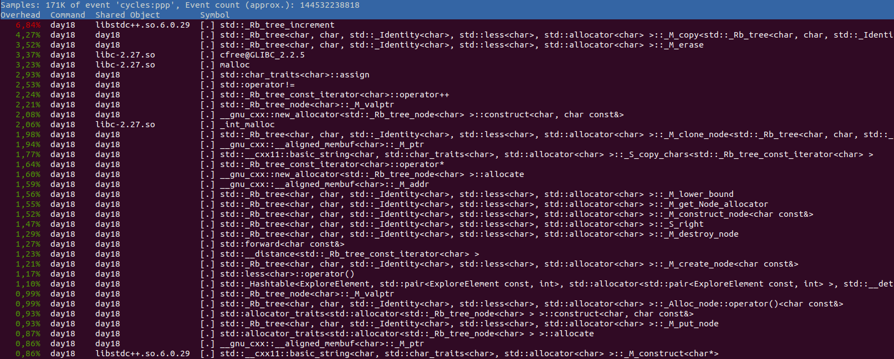
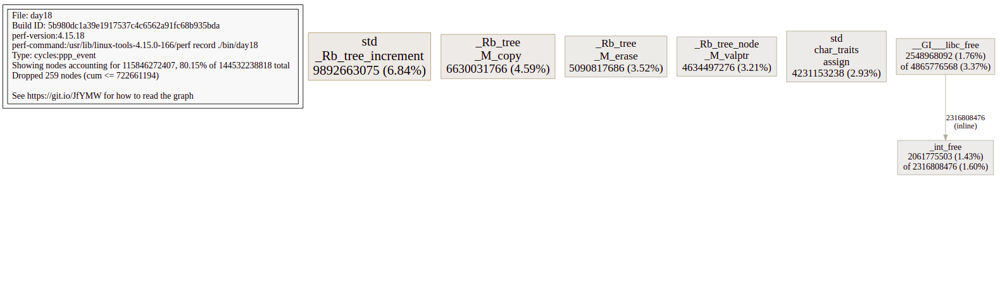

## Profiling and Optimizing a C++ Program

I was happy to  have finally cracked the [day 18 of Advent of Code 2019](https://adventofcode.com/2019/day/18) and finish all puzzles there.
The task was to find the shortest path which collects all keys in a maze.
Some parts of the maze are behind a door, with a look, which can be opened by the corresponding key.
Hence, the order of the key collection is important.
I got a [working solution](https://github.com/weichslgartner/AdventOfCode2019/blob/4461a9caac039a2e3c541c2d4e92332b87f9c138/day18/src/day18.cpp) but the execution time was still not great:

```
time ./bin/day18                   
Part 1: 4246
Part 2: 1940

________________________________________________________
Executed in   12,74 secs    fish           external
   usr time   12,62 secs    1,07 millis   12,62 secs
   sys time    0,12 secs    0,05 millis    0,12 secs
```

Especially, part b was very slow. 

To dig in why it was so slow i used Linux perf to profile.
In the past I also tried Intel's Vtune, but this time I wanted to use perf as I saw [Fedor Pikus using it in his 2021 cppcon talk](https://www.youtube.com/watch?v=g-WPhYREFjk).

### Get the Profile

To get the profiling data we run perf in a root shell (`sudo -s`; alternativly you can enable temporaly perf in userspace with `sudo sysctl -w kernel.perf_event_paranoid=-1` but then some symbols were missing so root was easier):

```
perf record ./bin/day18                                 
Part 1: 4246
Part 2: 1940
[ perf record: Woken up 25 times to write data ]
[ perf record: Captured and wrote 6.618 MB perf.data (173016 samples) ]
```

This created a file with the name `perf.data`.
We make this readable from userspace with:

```
chmod +r perf.data  
```

Now we can exit the root shell (`Ctrl+D`) and continue as normal user.
The  `perf.data` file can be analyzed with:

```
perf report
```


We see that a lot of time is spent in "Rb_tree*" computation and memory allocation.
[Red Black Trees (RB Trees)](https://en.wikipedia.org/wiki/Red%E2%80%93black_tree) are for ordered sets or ordered hash maps.
Indeed I used an ordered set (from `#include <set>`) to track my keys and locks. 
Cause I needed to track also the locations which I already explored, I converted the char set to a string and hashed this string with `std::hash<std::string>{}(keys)`.
These strings are also using dynamic memory allocation (they get bigger than small string optimization size).
So if we can replace this inefficient ordered sets with something less compute intensive we should get the execution time down.


### Visualize the Profling data

We already found what we searched for, but let's quickly install [google's pprof](https://github.com/google/pprof) a nice visualization tool for profile data.

We can install it with the following comand (given an installed Go compiler):

```
go get github.com/google/pprof@latest 
```

It might be that you need to set up your Go environment (fish shell):

```
set -x GO111MODULE on
set -x PATH ~/go/bin $PATH  
```

Or if you use bash:

```
export GO111MODULE=on
export PATH=~/go/bin:$PATH  
```

The we need another google tool to convert perf data.
This one uses Bazel build system, but my local bazel was quite old and I read on the internet that the cool kids use bazelisk to keep their bazel uptodate.


```
go get github.com/bazelbuild/bazelisk@latest 
git clone https://github.com/google/perf_data_converter.git 
cd perf_data_converter
bazelisk build src:perf_to_profile
```

Install it with:

```
sudo cp bazel-bin/src/perf_to_profile /usr/local/bin/
```


In our advent of code folder we can use pprof now in the browser:

```
pprof -web ./bin/day18 perf.data  
```


You can also profile and visualize a lot of other cool stuff with perf and pprof, but let's cover this another time.


## Use a More Efficient Data Structure than Set

As we identified the root cause of our high execution time (ordered sets and temporary strings), it is time to fix it.
We used ordered sets to store characters (`['a' .. 'z']` for keys and  `['A' .. 'Z']` for locks).
Hence, the maximal length is 26. 
So if we use [one hot encoding](https://en.wikipedia.org/wiki/One-hot) we can fit this in a 32 bit value.

We change our central data structure from:

```
struct ExploreElement {
  std::set<char> keys;
  std::set<char> locks;
  std::array<Point, 4> cur_point;
  int steps;
  bool operator==(const ExploreElement &other) const {
    return std::string(keys.begin(), keys.end()) ==
               std::string(other.keys.begin(), other.keys.end()) &&
           cur_point[0] == other.cur_point[0] &&
           cur_point[1] == other.cur_point[1] &&
           cur_point[2] == other.cur_point[2] &&
           cur_point[3] == other.cur_point[3];
  }
};
```
To:
```cpp
struct ExploreElement {
  std::set<char> keys;
  std::set<char> locks;
  std::array<Point, 4> cur_point;
  int steps;
  bool operator==(const ExploreElement &other) const {
    return std::string(keys.begin(), keys.end()) ==
               std::string(other.keys.begin(), other.keys.end()) &&
           cur_point[0] == other.cur_point[0] &&
           cur_point[1] == other.cur_point[1] &&
           cur_point[2] == other.cur_point[2] &&
           cur_point[3] == other.cur_point[3];
  }
};
```

So our datastruct got much smaller and also the operations are simpler now.
To check if two key sets are the same wie can now use the `=` operator.

To define the position of a character in our new datastructure we define:

```cpp
constexpr uint32_t key_index(uint8_t c){
  return 1UL << static_cast<uint8_t>((c-'a'));
}

constexpr uint32_t lock_index(uint8_t c){
  return 1UL << static_cast<uint8_t>((c-'A'));
}
```


Where we used `keys.size()` before, we can now count the 1 bits with the c++ 20 `std::popcount()`:

```cpp
struct LessThanExploreElement {
  bool operator()(const ExploreElement &lhs, const ExploreElement &rhs) const {
    return std::popcount(lhs.keys) + lhs.steps > std::popcount(rhs.keys) + rhs.steps;
  }
};
```

To add a key (equivalent to `set<char>::insert(char c)`) we can use a logical or:

```cpp
keys |= key_index(c);
```

To check if a key is set (equivalent to `set<char>::find(char c)`) we use a logical and:

```cpp
static_cast<bool>(key_index(c) & keys)
```

Finally, we have to change some CMake stuff.

Change to C++20:
```
set(CMAKE_CXX_STANDARD 20)
```

Add `march=native` to activate popcount [x86 assembly support](https://stackoverflow.com/questions/52161596/why-is-builtin-popcount-slower-than-my-own-bit-counting-function/52161813) in [Cmake](https://stackoverflow.com/questions/46724267/cmake-march-hardware):

```
include(CheckCXXCompilerFlag)
CHECK_CXX_COMPILER_FLAG("-march=native" COMPILER_SUPPORTS_MARCH_NATIVE)
if(COMPILER_SUPPORTS_MARCH_NATIVE)
    set(CMAKE_CXX_FLAGS "${CMAKE_CXX_FLAGS} -march=native")
endif()
```


The difference between compiling with `march=native` and without can be seen at the [godbolt diff](https://godbolt.org/z/GfKxbj8Pv). 
The left assembly uses `march=native` and generates the [x86 popcnt instruction](https://en.wikipedia.org/wiki/SSE4#POPCNT_and_LZCNT) while right assembly uses quite some instructions for bit counting. 


Now rebuild our program:

```
cmake  -DCMAKE_CXX_COMPILER=clang++ -DCMAKE_BUILD_TYPE=Release .. -G Ninja  && cmake --build . --target day18
```

And measure:
```
time ./bin/day18 
Part 1: 4246
Part 2: 1940

________________________________________________________
Executed in  213,32 millis    fish           external
   usr time  212,59 millis    0,00 micros  212,59 millis
   sys time    0,94 millis  939,00 micros    0,00 millis
```

Pretty good speed up or?
The changed program can be found [here](https://github.com/weichslgartner/AdventOfCode2019/blob/d405e22a6003ac10fdd0c1193f1aa27ecfb569b2/day18/src/day18.cpp).